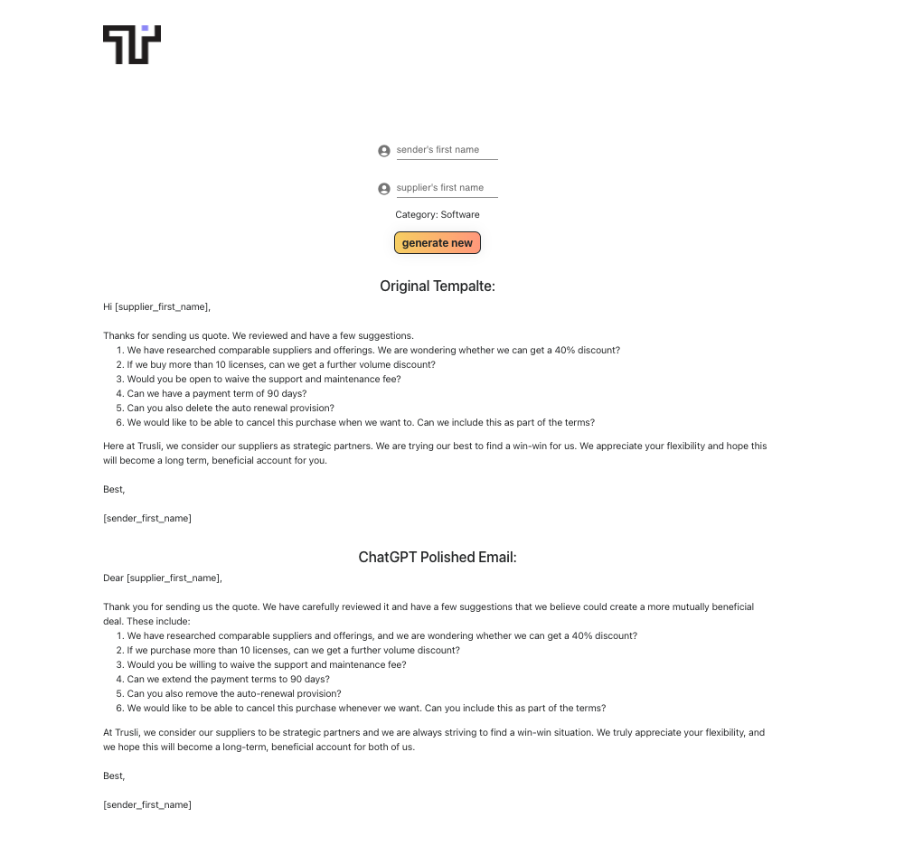

# how to run the project

step 1: install packages by running

```
npm ci
```

step 2: create a .env file with your ChatGPT token
REACT_APP_OPENAI_API_KEY="<your token>"

step 3: run the following script to run

```
npm run start
```

# demo


